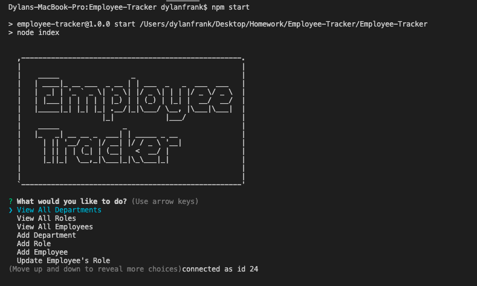

# Employee Tracker

## Description

This app is a Command Line Interface (CLI) and is used to create an Employee Management System where you can add Employees, Roles, and Departments and view them all as well. It utilizes MySql and Sql Workbench to add and query data from the database. The information is persistent across sessions and can be developed over time to delete roles, departments, and employees as well.

## Table of Contents 

* [Installation](#installation)

* [Usage](#usage)

* [License](#license)

* [Contributing](#contributing)

* [Tests](#tests)

* [Questions](#questions)

## Installation

To install necessary dependencies, run the following command:

`
npm i
`

## Usage

Once installed, user will need to run `npm start` to begin the app and follow the prompts.

## License

This project is licensed under GPL-3.0.
  
## Contributing

Anyone and Everyone!

## Tests

To run tests, run the following command:

`
n/a
`

## Questions

If you have any questions about the repo,please contact me at drfrank22@gmail.com.

## Demo

<a href="https://www.youtube.com/watch?v=gHNFCPFVK4s&feature=youtu.be">View a demo of the CLI here.</a>